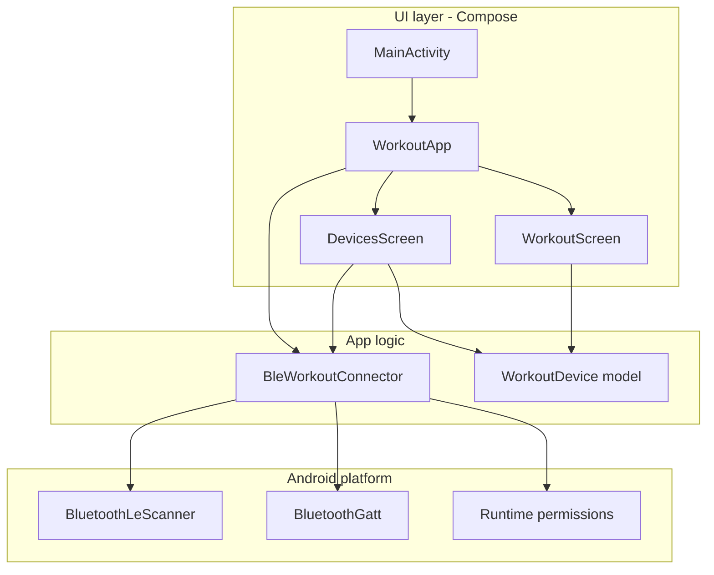
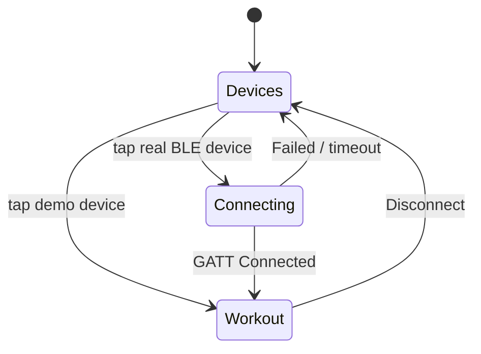
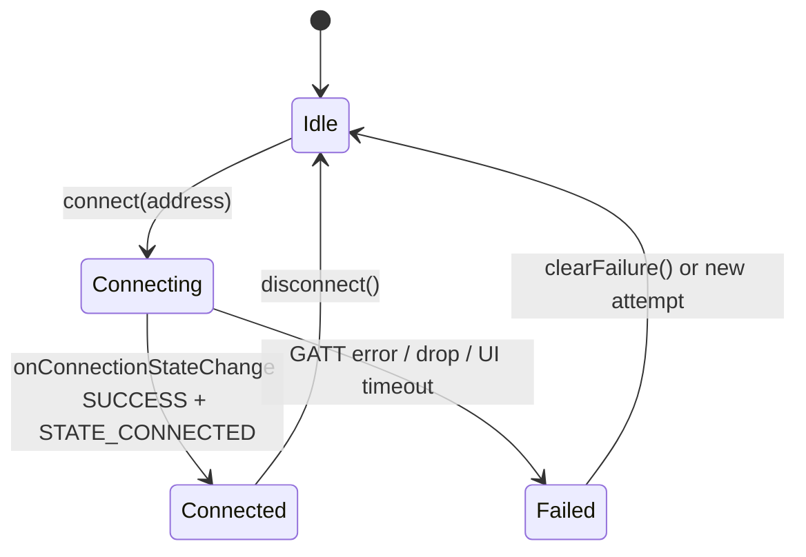
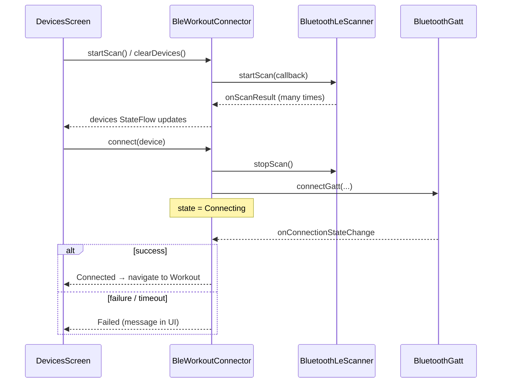
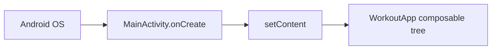
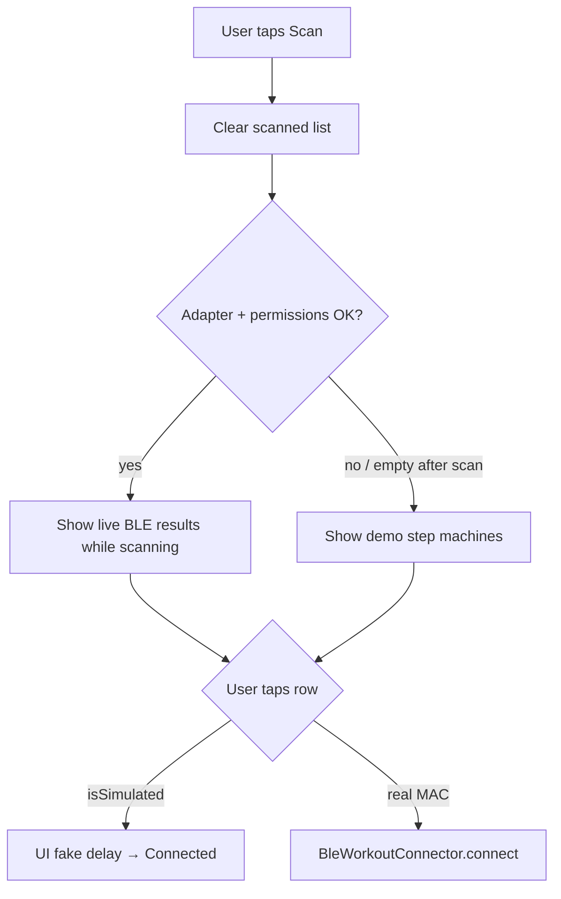
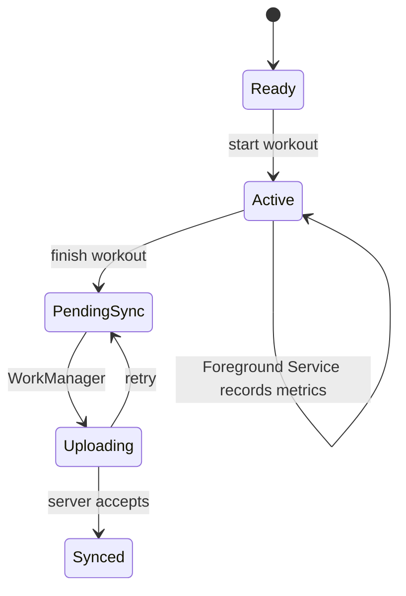

# Workoutapp

A learning-focused Android app that simulates a gym **step machine** workout.

Today it covers:

1. **Discover / connect** to a BLE device (or a demo device on emulator)
2. **Workout UI** with live step count + elapsed time (locally simulated ticks)

Kotlin + Jetpack Compose. Bluetooth Low Energy (BLE) client only — no GATT server.

---

## High-level architecture



| Piece | Role |
|-------|------|
| `MainActivity` | Android entry point only (`setContent`) |
| `WorkoutApp` | Owns navigation state + `BleWorkoutConnector` lifetime |
| `DevicesScreen` | Scan UI, permissions, connect / demo connect |
| `WorkoutScreen` | Steps + timer while “connected” |
| `BleWorkoutConnector` | Real BLE scan + GATT connect; exposes `StateFlow`s |
| `WorkoutDevice` | Device id/name + `isSimulated` flag |

---

## Screen flow

Simple state navigation (no Navigation Compose yet): if a device address is saved → workout, else → devices.



```text
DevicesScreen  --onDeviceConnected-->  WorkoutScreen
WorkoutScreen  --onDisconnect------>  DevicesScreen
```

---

## BLE connection state machine

`BleConnectionState` mirrors a real GATT attempt:



### Scan vs connect (two different BLE jobs)



**Android learning points**

- **Scan** discovers advertisers. It does **not** open a data link.
- **GATT connect** opens a client session to one device’s GATT server.
- Results arrive in **callbacks** (`ScanCallback`, `BluetoothGattCallback`), not as return values from `startScan()` / `connectGatt()`.
- We publish those callbacks into **`StateFlow`** so Compose can collect and recompose.

---

## Package layout

```text
app/src/main/java/com/rick/workoutapp/
├── MainActivity.kt              # Activity shell
├── bluetooth/
│   ├── BleWorkoutConnector.kt   # scan + GATT
│   └── BleConnectionState.kt    # Idle/Connecting/Connected/Failed
├── model/
│   └── WorkoutDevice.kt         # device + demo list
└── ui/
    ├── WorkoutApp.kt            # root composable + nav state
    ├── DevicesScreen.kt
    ├── WorkoutScreen.kt
    └── theme/
```

---

## Android-specific concepts used here

### 1. Activity + Compose



`MainActivity` is the system-visible component. UI lives in Compose, not XML layouts.

### 2. Permissions (Android 12+)

| API level | What we request |
|-----------|-----------------|
| 31+ (S) | `BLUETOOTH_SCAN`, `BLUETOOTH_CONNECT` |
| 30 and below | `BLUETOOTH`, `BLUETOOTH_ADMIN`, `ACCESS_FINE_LOCATION` |

Declared in `AndroidManifest.xml`, requested at runtime from `DevicesScreen` via `ActivityResultContracts`.

`BLUETOOTH_SCAN` uses `neverForLocation` so scanning is not treated as a location feature on newer APIs.

### 3. Why demo devices exist

The **official emulator does not pass through PC Bluetooth**. Real scans are usually empty; connects time out.



### 4. Compose state that survives rotation

`WorkoutApp` stores the connected device with `rememberSaveable` so a configuration change does not kick you back to the device list mid-workout.

### 5. Connector lifetime

```text
remember { BleWorkoutConnector(appContext) }
DisposableEffect → onDispose { connector.release() }
```

Uses `applicationContext` to avoid leaking an Activity. `release()` stops scan and closes GATT.

---

## Planned architecture (not built yet)

Target design when the workout becomes “real”:



| Piece | Responsibility |
|-------|----------------|
| **Foreground Service** | Owns live session + equipment link while working out |
| **Room** | Durable source of truth (session status, metrics) |
| **WorkManager** | Reliable upload after workout ends |
| **UI** | Observes Room / flows; does not own the session |

Today, steps/timer run **inside `WorkoutScreen`** with a `LaunchedEffect` — fine for UI learning, not for a real background session.

---

## How to run

1. Open the project in Android Studio.
2. Run on an **emulator** → use a **demo** step machine after Scan.
3. Run on a **physical phone** → grant Bluetooth permissions → Scan → tap a real BLE advertiser to attempt GATT connect.

```bash
./gradlew :app:assembleDebug
```

---

## Branch status (learning path)

| Area | Status |
|------|--------|
| Compose workout meter | Done |
| Device list + demo connect | Done |
| Real BLE scan + GATT connect | Done (link only) |
| `discoverServices` / characteristics | Not yet |
| Foreground Service | Not yet |
| Room + WorkManager upload | Not yet |

---

## References

- [BLE overview](https://developer.android.com/guide/topics/connectivity/bluetooth/ble-overview)
- Platform samples: `platform-samples/samples/connectivity/bluetooth/ble` (`FindBLEDevicesSample`, `ConnectGATTSample`)
- Older samples: `connectivity-samples/BluetoothLeGatt`
